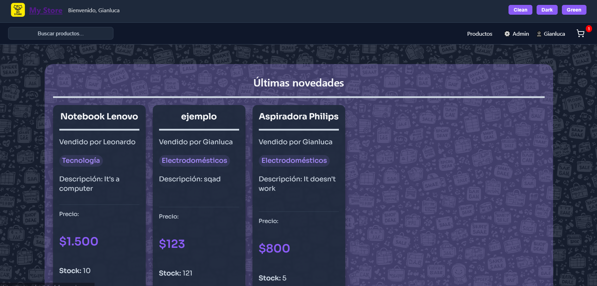
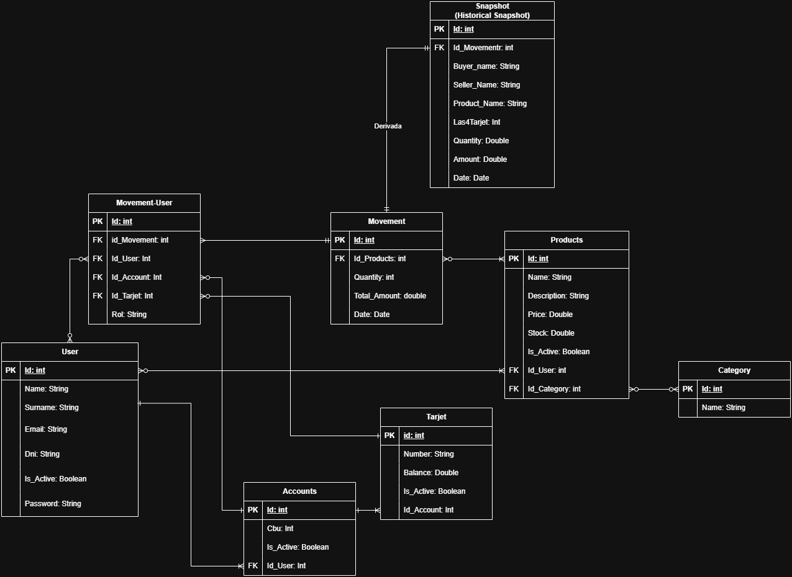
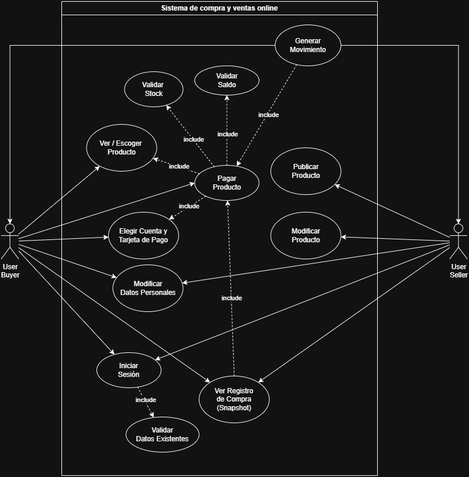

# Plataforma Web de Compra y Venta


Aplicación web orientada a la compra y venta de productos, desarrollada bajo una arquitectura cliente-servidor de 3 capas.

---

# Vista Previa



---

# Tabla de Contenidos

* [Introducción](#introducción)
* [Funcionalidades](#funcionalidades)
* [Arquitectura del Sistema](#arquitectura-del-sistema)
* [Tecnologías Utilizadas](#tecnologías-utilizadas)
* [Estructura del Proyecto](#estructura-del-proyecto)
* [Base de Datos](#base-de-datos)
* [Seguridad Implementada](#seguridad-implementada)
* [Instalación y Ejecución](#instalación-y-ejecución)
* [Docker](#docker)
* [Despliegue](#despliegue)
* [Colección Postman](#colección-postman)
* [Arquitectura Backend](#arquitectura-backend)
* [Arquitectura Frontend](#arquitectura-frontend)
* [Buenas Prácticas Aplicadas](#buenas-prácticas-aplicadas)
* [Aprendizajes](#aprendizajes)
* [Integrantes](#integrantes)

---

# Introducción

Plataforma web de comercio electrónico desarrollada como proyecto integrador, permitiendo a los usuarios interactuar tanto como compradores como vendedores.

El sistema fue desarrollado aplicando conocimientos relacionados con:

* Desarrollo Backend
* Desarrollo Frontend
* APIs REST
* Arquitectura de Software
* Persistencia de Datos
* Seguridad y Autenticación
* Dockerización
* Despliegue Cloud

---

# Funcionalidades

* Registro e inicio de sesión
* Autenticación JWT
* Gestión de productos
* Sistema de carrito de compras
* Gestión de cuentas y tarjetas
* Historial de movimientos
* Relación comprador-vendedor
* Soft delete de entidades
* Validaciones backend/frontend
* API RESTful

---

# Arquitectura del Sistema

La aplicación fue desarrollada utilizando una arquitectura cliente-servidor de 3 capas:

```
Frontend (React)
        ↓ HTTP / JSON
Backend API REST (Node.js + Express)
        ↓ Sequelize ORM
Base de Datos (PostgreSQL)
```

## Capas del Sistema

### Capa de Presentación

Implementada mediante React.js.

Responsable de:

* Renderizar la interfaz gráfica
* Gestionar navegación
* Consumir la API REST

### Capa de Lógica de Negocio

Implementada mediante Node.js y Express.js.

Responsable de:

* Procesar requests HTTP
* Gestionar autenticación
* Aplicar reglas de negocio
* Coordinar operaciones CRUD

### Capa de Datos

Implementada mediante PostgreSQL y Sequelize ORM.

Responsable de:

* Persistencia de información
* Relaciones entre entidades
* Integridad de datos

---

# Tecnologías Utilizadas

## Frontend

* React.js
* React Router DOM
* Axios
* Context API
* Vite

## Backend

* Node.js
* Express.js
* Sequelize ORM
* JWT
* Bcrypt
* Joi

## Base de Datos

* PostgreSQL

## Herramientas

* Git
* GitHub
* Postman
* Docker
* Render

---

# Estructura del Proyecto

## Backend

```
backend/
└── src/
    ├── controllers/
    ├── middleware/
    ├── models/
    ├── routes/
    ├── services/
    └── utils/
```

## Frontend

```
frontend/
└── src/
    ├── components/
    ├── context/
    ├── layouts/
    ├── pages/
    ├── routes/
    └── services/
```

---

# Base de Datos

La aplicación utiliza PostgreSQL junto con Sequelize ORM para la administración de modelos y relaciones.

## Entidades Principales

* Usuarios
* Cuentas
* Tarjetas
* Productos
* Categorías
* Movimientos
* Carritos
* Items de carrito

## Relaciones

* Un usuario puede tener múltiples cuentas
* Un usuario puede publicar múltiples productos
* Un producto pertenece a una categoría
* Un movimiento involucra comprador y vendedor
* Un usuario posee un único carrito

## Diagrama ER



## Diagrama Caso De Uso




---

# Seguridad Implementada

* Hash de contraseñas mediante bcrypt
* Autenticación JWT
* Middlewares de autorización
* Validaciones con Joi
* Protección de rutas privadas
* Variables de entorno
* Soft delete

---

# Instalación y Ejecución

## Clonar Repositorio

``` 
git clone https://github.com/GianlucaFagherazzi/EntregaFinalLabo4.git
```

---

## Variables de Entorno Backend

```
PORT=3000

DB_NAME=tpfinal
DB_USER=postgres
DB_PASS=12346
DB_HOST=db
DB_PORT=5432

JWT_SECRET=secret
JWT_EXPIRES_IN=10h
```

---

## Variables de Entorno Frontend

```
VITE_API_URL=http://localhost:3000
```

---

# Docker

## Ejecutar Contenedores

```
docker compose up --build
```

## Detener Contenedores

```
docker compose down
```

---

# Despliegue

## Frontend

```
https://entregafinallabo4-1.onrender.com
```

## Backend

```
https://entregafinallabo4.onrender.com
```

---

# Colección Postman

La colección Postman se encuentra incluida dentro del repositorio:

```
/docs/postman_collection.json
```

Ingrese a postman, seleccione archivo, importar, y seleccione el archivo postman_collection.json

Incluye:

* Endpoints
* Requests de ejemplo
* Respuestas de ejemplo
* Autenticación JWT
* Operaciones CRUD

---

# Arquitectura Backend

El backend sigue una arquitectura en capas:

```
Request
   ↓
Routes
   ↓
Middlewares
   ↓
Controllers
   ↓
Services
   ↓
Models
   ↓
Database
   ↓
Response
```

---

# Arquitectura Frontend

El frontend sigue una estructura modular:

```text id="vqmbz6"
Usuario
   ↓
Routes
   ↓
Layouts
   ↓
Pages
   ↓
Components
   ↓
Services
   ↓
Backend API
   ↓
UI
```

---

# Buenas Prácticas Aplicadas

* Arquitectura modular
* Separación de responsabilidades
* Código reutilizable
* Manejo centralizado de errores
* Validaciones backend/frontend
* Soft delete
* JWT Authentication
* Deploy Cloud

---

# Aprendizajes

Durante el desarrollo del proyecto se trabajó con:

* Arquitectura cliente-servidor
* Diseño de APIs REST
* Persistencia con Sequelize ORM
* Dockerización
* Deploy en Render
* Manejo de autenticación JWT
* Gestión de estados globales en React

---

# Integrantes

* Gianluca Fagherazzi
* Leonardo Telez
